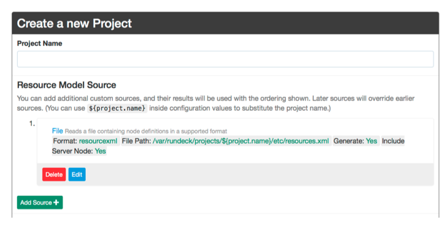

% Project Create

A project can be created either from the graphical console or using the
[rd] shell tool.

In the graphical console, you will notice a Project
menu in the top navigation bar. If no projects exist, you will be prompted to
create a new project.

Press the "New Project" button to create a project.  Project names can contain letters and numbers but do not use spaces or special characters.

After entering your project name, Rundeck initializes it and returns
you to the "Jobs" page.

Projects can be created at any time by going back to the Project menu
and selecting the "Create a new project..." item.

The project setup process generates Project configuration in the server, and
a bootstrap resource model containing information about the rundeck server node.

## Automating

Note: As of Rundeck 2.7.0, the Rundeck CLI tools are replaced with a single tool
called `rd`, which can be installed separately.

See the [rd] website to install.

The [rd projects][rd] command can be used to create a
project.

Execute the `rd projects create` command and
specify a project name, here we use "examples":

~~~~~~~~~~~~~~~~~~~~~~~~~~~~~~~~~~~~~~~~~~~~~~~~~ {.bash}
rd projects create -p examples
~~~~~~~~~~~~~~~~~~~~~~~~~~~~~~~~~~~~~~~~~~~~~~~~~

You can also add configuration properties when you create the project.
Here the default SSH key setting is declared via the `project.ssh-keypath`:

~~~~~~~~~~~~~~~~~~~~~~~~~~~~~~~~~~~~~~~~~~~~~~~~~ {.bash}
rd projects create -p examples -- --project.ssh-keypath=/home/rundeck/.ssh/id_rsa
~~~~~~~~~~~~~~~~~~~~~~~~~~~~~~~~~~~~~~~~~~~~~~~~~

You can specify a resource model source using command options, too.
Here a "directory" model source is declared.

~~~~~~~~~~~~~~~~~~~~~~~~~~~~~~~~~~~~~~~~~~~~~~~~~ {.bash}
rd projects create -p examples -- \
  --resources.source.2.type=directory \
  --resources.source.2.config.directory=/path/to/my/resources.d
~~~~~~~~~~~~~~~~~~~~~~~~~~~~~~~~~~~~~~~~~~~~~~~~~

Administrators can place multiple resource model files in this directory.

[rd]: https://rundeck.github.io/rundeck-cli/

## API Usage

All Project creation, configuration, deletion, etc can be achieved via the [API](../../api/index.html).

[Create projects](../../api/index.html#project-creation):

    POST /api/13/projects
    Content-Type: application/json

    { "name": "myproject", "config": { "propname":"propvalue" } }

[Delete projects](../../api/index.html#project-deletion):

    DELETE /api/13/project/myproject

[Project configuration](../../api/index.html#project-configuration)

    PUT /api/13/project/myproject/config
    Content-Type: application/json

    {
        "key":"value",
        "key2":"value2..."
    }

